### **概述**
***
如果您遇到过以下烦恼，PPT画图慢且不美观，尝试这款`thinkcell`软件。
> `thinkcell`是世界五百强公司和咨询公司最常用的图表绘制工具。以插件的形式嵌入到PPT中，对于内存等资源的占用不大。

下面是使用thinkcell的简单教程，想获取更多请参考[官网教程](https://www.think-cell.com/download)

### **安装`thinkcell`**
***
**STEP 1 进入`thinkcell`官网下载页面 点此进入[下载页面](https://www.think-cell.com/download)

**STEP 2 输入学校或企业邮箱，点击`Request download information`**

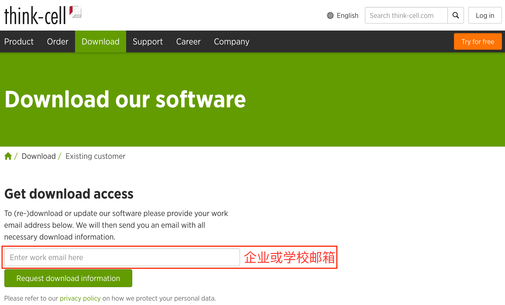

**STEP 3 收到邮件后，点击链接进入注册页面**

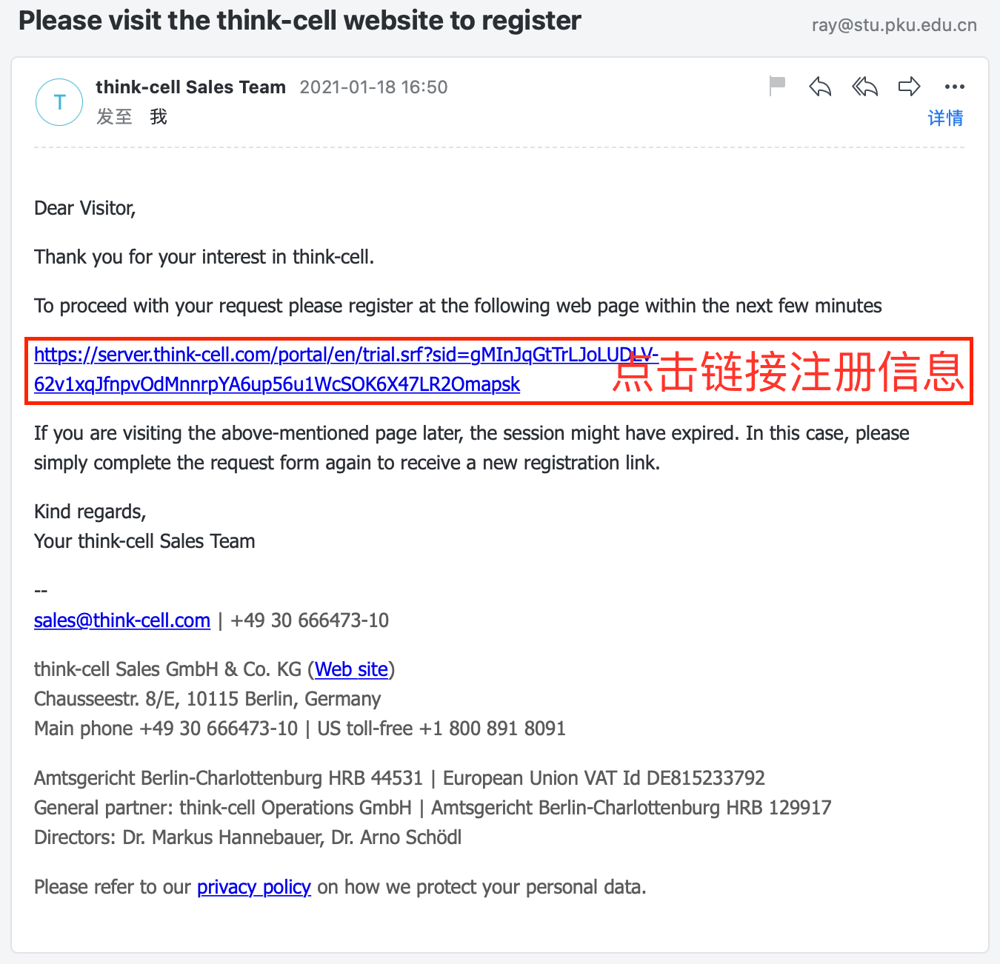

**STEP 4 填写注册信息**

注：北大学生能在`Unit`中找到所在学院
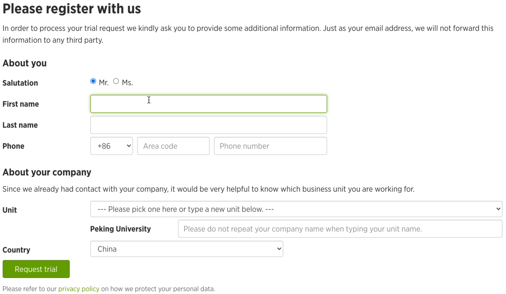

**STEP 5 下载安装包**

注：复制授权码
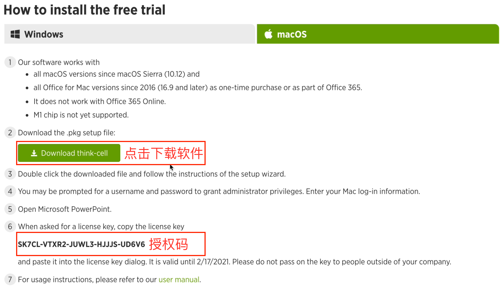

**STEP 6 安装软件**

**STEP 7 输入授权码并安装**

**STEP 8 插件安装成功**

注：插件安装成功后，请访问[支持页面](https://www.think-cell.com/download)，获得更多教程
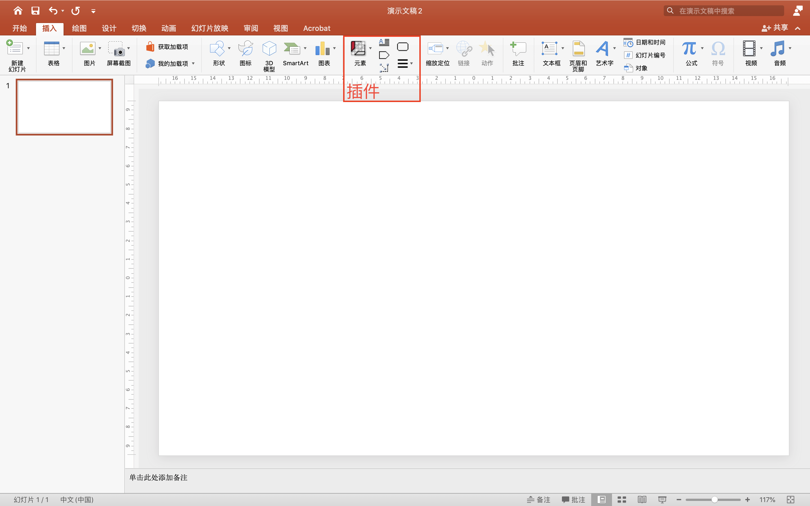
### **基本概念**
***
#### **STEP 1 认识界面**

`元素`(基本元素、议程、图表类型)
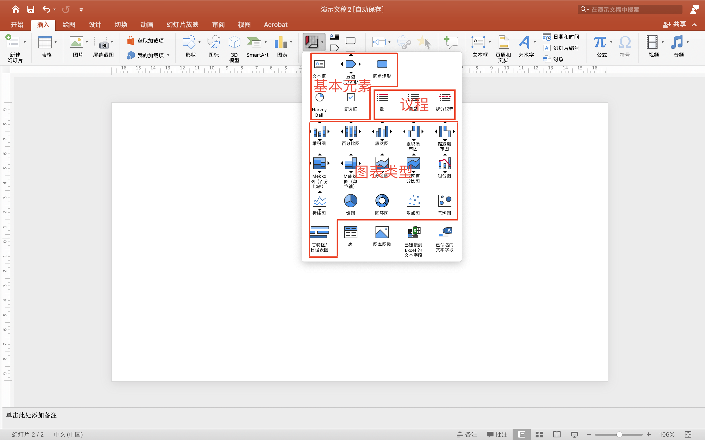

`通用连接器` 
> 每个图表元素都能提供可连接的点。通用连接器能连接属于或不属于同一元素的任意两个可连接的点

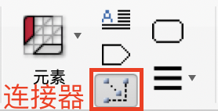
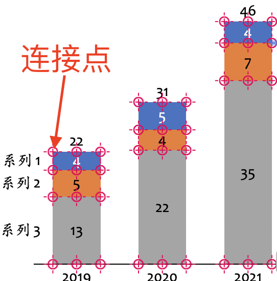

`其他工具` 
> 其中，用户手册包含讲授所有基本概念的简短章节，以及有关制作图表简介和布局简介的简介章节。当然，该手册还详细讲述了所有产品功能，并为高级用户提供了提示和技巧

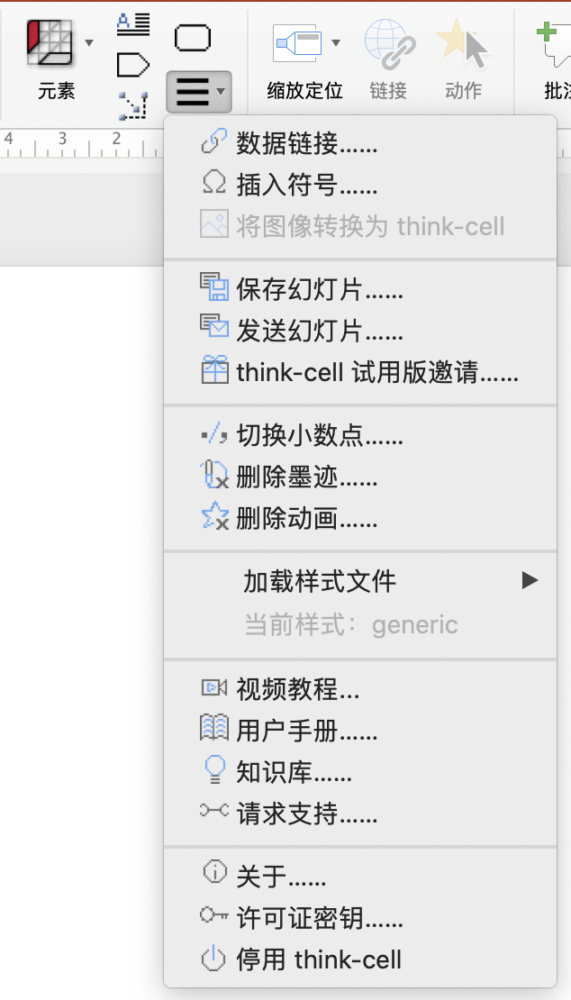

#### **STEP 2 插入元素**
* 方法一
> 图表类型->选择朝向->左键单击

* 方法二
> 图表类型->选择朝向->长按左键下拉调整大小

#### **STEP 3 输入数据**
创建新图表时，自动打开`Excel`输入数据
* 方法一
> 双击图表空白区域

* 方法二
> 单击图标右下角`打开数据表` 

#### **STEP 4 选择元素及特征**
* 浮动工具栏
> 左键单击选择某元素或特征，显示浮动工具栏，可对外观进行更改

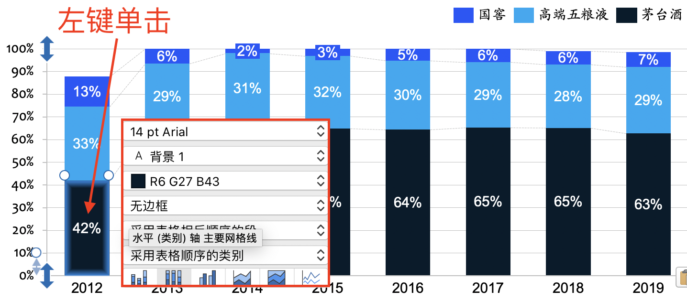

* 上下文菜单
> 右键单击某特征时，会显示其上下文菜单，可将其他特征添加到元素或删除当前可见的特征

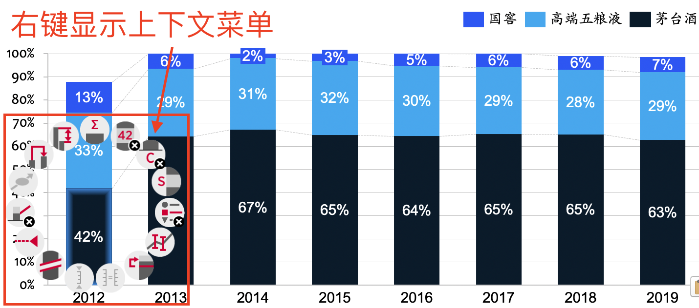

* 选择元素及特征
1. 选择同类元素
> 同时按住`command` `A`，选中后显示蓝色阴影框

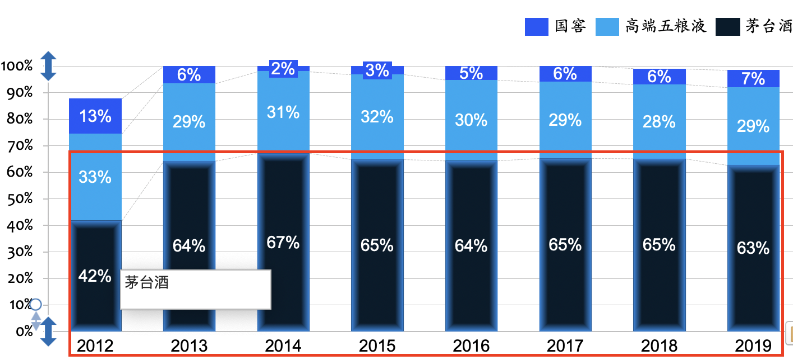

2. 选择多类元素
> 按住`shift`，移动鼠标，选中后显示橘色阴影框

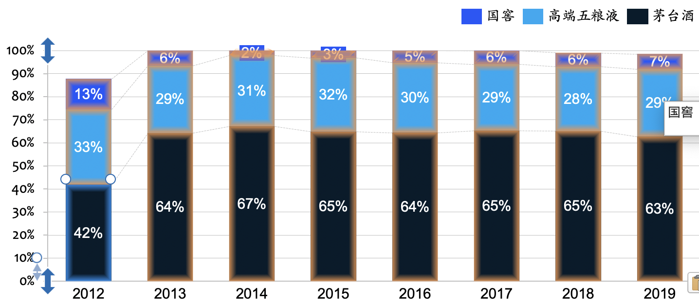

### **插入图表**
***
#### **堆栈图**
* 下面我们以绘画2012-2019高端白酒市场历年占有率情况为例
> 簇状图、百分比图同理可画出

点击查看视频 [堆栈图](https://v.qq.com/x/page/b3223l21mvy.html)

#### **瀑布图**
* 下面我们以绘画2020年四季度卖出数量的瀑布图

点击查看视频 [瀑布图](https://v.qq.com/x/page/c3223pu94b8.html)

#### **Mekko图**
* 下面我们以绘画三家公司在北京、上海、广州的占有率的Mekko图

点击查看视频 [Mekko](https://v.qq.com/x/page/q3223f1yjst.html)

### **结语**
***
通过以上教程，您已经掌握了使用thinkcell的入门技巧，想获取更多高阶技巧请参考[官网教程](https://www.think-cell.com/download)